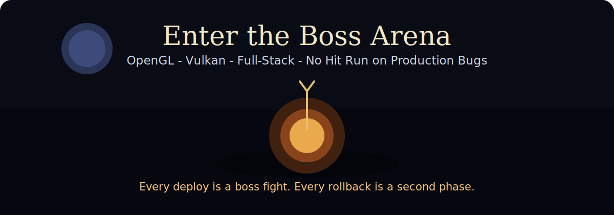

<h1 align="center">Lewis Nganga</h1>

<b>Full-Stack Developer | OpenGL & Vulkan Enthusiast | Software Engineering Student</b>

    
    

---

## Hi there 👋

    

I love building software from low-level graphics to polished full-stack apps.

- Rendering and graphics programming with `OpenGL` and `Vulkan`
- Full-stack development with `React`, `TypeScript`, `JavaScript`, `C#`, and `.NET`
- Always learning, building, and improving one project at a time

## What I Do

- Build interactive web apps with modern frontend and backend tooling
- Explore real-time rendering concepts, graphics pipelines, and performance optimization
- Blend clean architecture with practical product-focused development

## Tech Stack

## Currently Focused On

- Advancing Vulkan/OpenGL rendering skills through hands-on projects
- Building robust full-stack applications end-to-end
- Writing cleaner, maintainable code and improving performance

## GitHub Stats

    
    

    

## Fun Fact

- I play guitar, love Souls games, and jump into Elden Ring for the occasional Tarnished run when I am not coding.

## Connect With Me

- Email: `flammylewis2000@outlook.com`
- GitHub: `github.com/lewis-2000`
